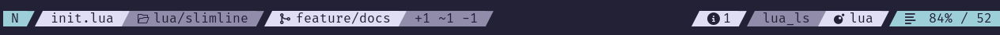

# How to write a custom neovim statusline

I am using Neovim as my daily driver for quite some time.
I also love customizing my tools to match exactly the look and feel I am looking for.
Since the statusline is an essential part of the Neovim workflow, I started with that.

This is how the final result looks like. More examples can be seen on the released public [slimline.nvim](https://github.com/sschleemilch/slimline.nvim) repository.
While this is a plugin, I will show here how to write a custom neovim statusline from scratch.





## Every start is hard

For the demo and if you want to follow along we can create a new config directory for neovim to not mess with your existing config like this:

- Create a directory in `.config` to serve as a new config dir: `mkdir ~/.config/nvim_dev`
- To start neovim using that directory instead of the default one you can use `NVIM_APPNAME="nvim_dev" nvim`

Setting the content of the statusline is all about filling `vim.o.statusline` with whatever you want to show in the line.

So let's create `~/.config/nvim_dev/init.lua` with the following content

```lua
vim.o.statusline = 'Hello World'
```

Now, start or restart neovim as shown before. Yay, we have our own statusline. Not very useful, I admit.

## Add a dedicated file for the statusline

Since we will write some lua code, we probably should not pollute the `init.lua` with all that statusline stuff, although it's empty:

- Create `~/.config/nvim_dev/lua/statusline.lua` and move the `vim.o.statusline` expression to that file
- Add `require('statusline')` to `init.lua`

Restarting neovim should still result into `Hello World` being the only thing in the statusline.
Congratulations, we have our own statusline module. Now let's add some useful parts.

## Mode component

Probably one of the most essential parts of a statusline is the mode you are currently in.

The current mode neovim is in can be fetched in lua via `vim.api.nvim_get_mode().mode`.
[here](<https://neovim.io/doc/user/builtin.html#mode()>) is a list of all values that can be returned.
The values like `n` for the normal mode are a bit weird to show them on a statusline.

Let's add a function in `statusline.lua` that returns the current mode in a suitable way.

```lua
local M = {}

--- Function to translate a mode into a string to show
--- @return string
function M.get_mode()
  -- Note that: \19 = ^S and \22 = ^V.
  local mode_map = {
    ['n'] = 'NORMAL',
    ['no'] = 'OP-PENDING',
    ['nov'] = 'OP-PENDING',
    ['noV'] = 'OP-PENDING',
    ['no\22'] = 'OP-PENDING',
    ['niI'] = 'NORMAL',
    ['niR'] = 'NORMAL',
    ['niV'] = 'NORMAL',
    ['nt'] = 'NORMAL',
    ['ntT'] = 'NORMAL',
    ['v'] = 'VISUAL',
    ['vs'] = 'VISUAL',
    ['V'] = 'VISUAL',
    ['Vs'] = 'VISUAL',
    ['\22'] = 'VISUAL',
    ['\22s'] = 'VISUAL',
    ['s'] = 'SELECT',
    ['S'] = 'SELECT',
    ['\19'] = 'SELECT',
    ['i'] = 'INSERT',
    ['ic'] = 'INSERT',
    ['ix'] = 'INSERT',
    ['R'] = 'REPLACE',
    ['Rc'] = 'REPLACE',
    ['Rx'] = 'REPLACE',
    ['Rv'] = 'VIRT REPLACE',
    ['Rvc'] = 'VIRT REPLACE',
    ['Rvx'] = 'VIRT REPLACE',
    ['c'] = 'COMMAND',
    ['cv'] = 'VIM EX',
    ['ce'] = 'EX',
    ['r'] = 'PROMPT',
    ['rm'] = 'MORE',
    ['r?'] = 'CONFIRM',
    ['!'] = 'SHELL',
    ['t'] = 'TERMINAL',
  }

  local mode = mode_map[vim.api.nvim_get_mode().mode] or 'UNKNOWN'
  return mode
end

vim.o.statusline = "%!v:lua.require'statusline'.get_mode()"

return M
```

As you can see a few more things happened here.
We need to call that method and put the value into the `vim.o.statusline`.

To do that we can use `%!v:`. The expression needs to know where to find our `get_mode()` function.
That's why we do a `require'statusline'`.

In order to be able to call `get_mode()` from whatever is returned by the `require` statement
we need to bind the method to a table and return it. `local M = {}` creates an empty table and `function M.get_mode()` attaches the method to that table.
Like this we are able to call `get_mode()` on the `require` statement.

You should now see the current mode changing accordingly in your statusline!

## Render

Since we probably do not only want to render one single component, let's create a `render()` function instead that renders our statusline
and that we can extend with other components:

```lua
---@return string
function M.render()
  return table.concat({
    M.get_mode(),
  }, ' ')
end
```

Also adapt the statusline content call accordingly:

```lua
vim.o.statusline = "%!v:lua.require'statusline'.get_mode()"
```

## File and path

Another crucial part for most people is the filename and path of the current buffer they are looking at.

```lua
---@return string
function M.get_path()
  if vim.bo.buftype ~= '' then
    return ''
  end
  local file = vim.fn.expand('%:t') .. '%m%r'
  local path = vim.fs.normalize(vim.fn.expand('%:h'))
  return 'file: '.. file .. ', root:' .. path
end
```

Not much is needed here. We are first checking whether the buffer is a normal buffer, otherwise we are not interested in the file path (see `:h buftype`).
The core logic is making use of `expand()` (see `:h expand`). `%` is the current file path and takes modifiers. Since in the final line I am
separating the filename and the path to that file I am using `:t` which is the last part of the path, meaning the filename only. As you would have guessed,
`%h` is the counterpart. `%r` expands to the read-only flag, meaning that it will be expanded to `[RO]` and `%m` the modified flag which will expand to `[+]` when
the buffer has been modified. Let's add that component to our statusline:

```lua
---@return string
function M.render()
  return table.concat({
    M.get_mode(),
    M.get_path()
  }, ' ')
end
```

## File progress

A component that shows the position of the cursor in the buffer in the style of `50% / 2000`, meaning we are at 50% of the buffer with 2000 lines.
This is the info I am sometimes curious about.
Here is our function:

```lua
--- @return string
function M.get_progress(sep, direction)
  local cur = vim.fn.line('.')
  local total = vim.fn.line('$')
  local content
  if cur == 1 then
    content = 'Top'
  elseif cur == total then
    content = 'Bot'
  else
    content = string.format('%2d%%%%', math.floor(cur / total * 100))
  end
  content = string.format('%s / %s', content, total)
end

return M
```

Probably you got the drill now and there is not much going on here. `:h line` will contain the info what `.` and `$` will expand to, but I guess the variable names speak for themselves.
There is some wild escaping going on for `%2d%%%%`. That is due to the fact that we want to print a `%` and need to escape it for the `string.format()`
as well as for the statusline string itself.

Let's add it to `M.render()`. However, we would like to use the full width of our line and place the progress on the right side.
For that we can use `%=` which expands the space between components equally.

```lua
---@return string
function M.render()
  return table.concat({
    ''
    M.get_mode(),
    M.get_path()
    '%='
    M.get_progress()
  }, ' ')
end
```

I hope the concept has become clear. Please check [slimline.nvim](https://github.com/sschleemilch/slimline.nvim) for more components and their more sophisticated implementation.

## Colors

Until now, our line looks a bit boring and is definitely missing some colors.
Colors in neovim are handled through **highlight groups**. You can think of them as a name for a certain background and foreground color.
`:hi` will show you all current highlight groups available in your neovim installation.
A lot of plugins define their own highlight groups.

Highlight groups in a statusline are active until another highlight group appears.

The statusline we built together probably has some background.
We could fix that for instance by applying the `Normal` highlight group to the complete line like this:

```lua
---@return string
function M.render()
  return table.concat({
    '%#Normal#'
    M.get_mode(),
    M.get_path()
    '%='
    M.get_progress()
  }, '%#Normal#')
end
```

So the pattern is `%#<GROUP>#` to activate a certain highlight for the text that follows.
We also added it as a second argument to `table.concat()` which is the separator between concatenated items.
It is quite handy since it will reset the highlight to `Normal` after each component.

Feel free to experiment at that point with highlight groups in components and the complete line.

You can also create own highlights using `:h nvim_set_hl`.
