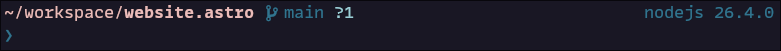
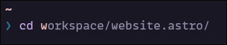
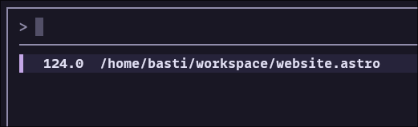
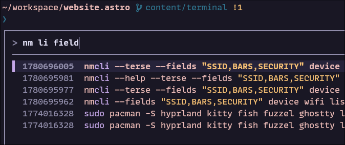
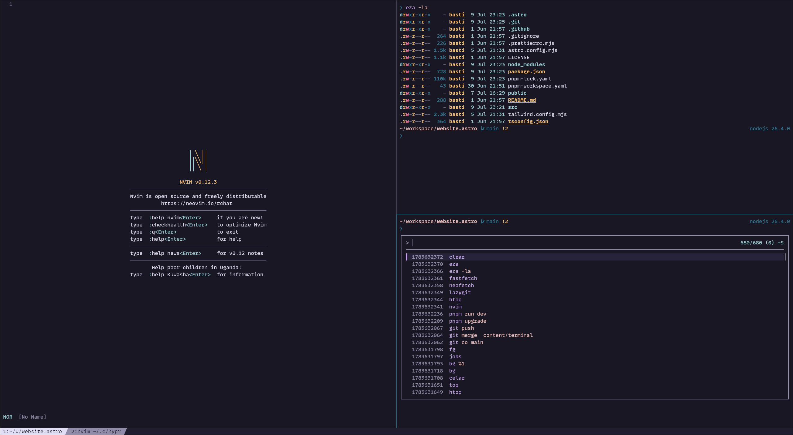

# The terminal

Over the years the terminal became my primary development environment.
This article walks through the different layers of that ecosystem—from the terminal emulator and shell to the tools and workflows that make staying in the terminal productive.
The goal isn't to avoid graphical applications, but to show how the terminal can become your home base.

## Terminal Emulator

Let's briefly talk about the stack.
It starts with a terminal emulator. A terminal emulator is a GUI application that emulates a hardware terminal.
Terminals go back a long way in computer history where there was a mainframe computer connected to multiple **terminals**.

Today's tasks of the terminal emulator are roughly:
- rendering text
- handling fonts
- rendering colors
- processing keyboard input
- GPU acceleration
- tabs and splits

Any OS offers a built-in terminal emulator.
However, some more feature-rich cross-platform emulators are:

- [ghostty](https://ghostty.org/)
- [kitty](https://sw.kovidgoyal.net/kitty/)
- [WezTerm](https://wezterm.org/index.html)
- [iTerm2](https://iterm2.com/) (macOS)
- [Alacritty](https://alacritty.org/)


## Shell

The shell is the program that lets you interact with your operating system.
It's responsible for launching programs, interpreting your input, and displaying their output.
Usually also associated with being a read-eval-print-loop (REPL).

Shells have scripting capabilities where commands can be written and executed from files.
Different shells have different scripting languages.

The most prominent shells (for unix) are:

- bash (Usually the default of any Linux distro)
- zsh (macOS default)
- fish
- nushell

Which one you are using is mostly a matter of taste.
I would recommend to start with `bash` or `zsh`. `bash` scripts are everywhere, and the chances are high that it is what you are dealing
with when remotely connecting to a machine or at least will be available.

Personally, I switched from `zsh` to `fish` two years ago because `fish` has more things out of the box.

However, the shell where you type your commands does not necessarily have to be the one that executes scripts.
Therefore, even when using e.g. `fish` you do not need to know the `fish` scripting language very well.

Scripts usually begin with a shebang line in the beginning that instructs the interpreter to use that particular program to interpret it.

In `bash` scripts you usually see something like the following:

```bash
#!/bin/bash
```

The shebang isn't limited to shell scripts. Any executable script can specify its interpreter.

E.g. using the `env` program to find the executable to invoke like so:

```
#!/usr/bin/env python3
```

The prompt is a part of the shell that shows additional information.
Usually it shows the current directory and indicators for the last command return code, but it can show much more if you want to.
It is very configurable and a candidate for a lot of customization and show off potential.

Here is my current fish one while writing this article, kept minimal.



It includes the current working directory, the current Git branch and status as well as some information about
the project programming language version, Python `venv` name etc.

There are several frameworks out there to configure it and make it very fancy (and distracting) in no time. To name a few popular ones:
- [starship.rs](https://starship.rs/), cross shell
- [oh-my-posh](https://ohmyposh.dev/), cross shell
- [powerlevel10k](https://github.com/romkatv/powerlevel10k), zsh only
- [tide](https://github.com/IlanCosman/tide), fish only

The shell is also responsible for configuring command aliases (e.g. so that you can write `g` instead of `git`),
environment variables and completion support (using `<tab>` to complete a path, a command etc.).

To actually do something useful you are launching applications.
While there are some shell built in commands, most of the programs you launch are external programs like `git`, `ssh` and so on.

## Organizing your workspace

Usually you want to do several things in parallel when working. Starting a service, editing a file, running tests, ....
Of course, you could start multiple terminal emulators to do so. However, one is definitely enough.

Modern terminal emulators often have native support for tabs and splits.
On top of this there exist so-called **terminal multiplexers**.

The most popular ones are [zellij](https://zellij.dev/) and [tmux](https://github.com/tmux/tmux/wiki).
The benefit of emulator independent multiplexers is obviously that you have to learn them once and can then
switch the terminal multiplexer anytime. Also, not all terminal emulators implement sessions.

I have been using `tmux` for a long time until I settled down using `kitty`'s native tabs and splits but emulating
the `tmux` key bindings. My current bindings are like that

```conf
map ctrl+shift+h previous_tab
map ctrl+shift+l next_tab

map ctrl+j neighboring_window bottom
map ctrl+k neighboring_window top
map ctrl+h neighboring_window left
map ctrl+l neighboring_window right

map ctrl+b>1 goto_tab 1
map ctrl+b>2 goto_tab 2
map ctrl+b>3 goto_tab 3
map ctrl+b>4 goto_tab 4
map ctrl+b>5 goto_tab 5
map ctrl+b>6 goto_tab 6
map ctrl+b>7 goto_tab 7
map ctrl+b>8 goto_tab 8
map ctrl+b>9 goto_tab 9

map ctrl+b>c new_tab
map ctrl+b>, set_tab_title

map ctrl+b>% launch --location=vsplit --cwd=current
map ctrl+b>" launch --location=hsplit --cwd=current
```

Everyone has to find the bindings that work best for them.
However, I have learned that trying to stick with default bindings can have its benefits as well.
Be it a foreign machine, a remote session or helping out a colleague.

## Efficient navigation

A lot of the tasks in the terminal require navigating to places.
The ground rule for everything you type in the terminal is to use the `<tab>` key whenever possible.

E.g. to navigate into my website to write a new article like this one I can do from `cd w<tab>` which expands already
into `cd workspace/` followed by `web<tab>` will expand to my final target `workspace/website.astro`.

Some shells offer **auto suggestions** either via plugins or natively that even reduce the needed keystrokes further.
They have an internal ranking of how often you are navigating into directories.
In my case it already suggests the target after one letter, which I can accept using **right arrow**:



Additionally, there exist shell independent tools to find directories you use frequently in a fuzzy manner.
The one I am using is [zoxide](https://github.com/ajeetdsouza/zoxide).
Unlike bookmarks, `zoxide` learns from the directories you visit. The more you use it, the better it gets at predicting where you want to go.

It offers two commands: `z` and `zi`. `z` will directly navigate into the best match for its argument.
`zi` will open an interactive window where you can select the prefiltered target list.

Therefore, `z web` also brings me into my `workspace/website.astro` project.
Usually I am using `zi` though when I am not sure that the argument will only have one result.

In this case, it does and I can navigate using `enter`:



This is really a tool made in heaven, especially at work where you have a lot of repositories.
A simple keyword is enough to find the right target using `zi` in seconds!

## Fuzzy finders

Technically, we already saw one of those categories in the section before with `zoxide`.
However, there are more generic tools out there that do interactive fuzzy matching on a list of inputs.

One very popular one is [fzf](https://github.com/junegunn/fzf).

It has some pre-defined shell integrations that are really neat.

`ctrl-r` overwrites the default recursive search of past typed commands with a more fancy and more useful one:

Very handy to search for longer commands with parts of it.

`ctrl-t` does search for files and directories. Selecting them via `<tab>` or directly pressing `<enter>`
inserts it into the current command. `alt-c` does the same but only for directories.

Those fuzzy finders can be used when writing small shell functions as well by piping things into it:

```bash
echo asdf\nabcd\xyz | fzf
```

Eventually you notice that you come to the point where you barely use `cd` anymore.

## Running and controlling programs

One thing that I was using pretty late is `ctrl-z`, `jobs` and `fg` but is pretty valuable on daily work.
Running programs can be suspended and put into background using `ctrl-z`, which suspends the program.

Be aware that they are being stopped and are not continuing whatever they do.
If you actually want the process to continue running in the background, use `bg`.

To get it back into the foreground you can use `fg`.
Listing all current jobs in the background can be done with `jobs`.
You can bring back a specific job with `fg %2`.

This is pretty useful when needing the shell shortly, and you do not want to spawn another split / tab.

## Terminal Apps

So far, we have talked a lot about utilities to move around and finding things quickly.
Unlike traditional command-line programs, TUIs (terminal user interfaces) draw an interactive interface inside the terminal.

Using TUIs greatly increases the usefulness of staying in the terminal.
One big part of that is an **editor**.

The most popular choices out there are:
- [neovim](https://neovim.io/)
- [helix](https://helix-editor.com/)
- [vim](https://www.vim.org/)
- [emacs](https://www.gnu.org/savannah-checkouts/gnu/emacs/emacs.html)

When not using yet any of these I would recommend `helix`.

Having a fully fledged editor in the terminal covers already quite some ground.
But we usually need more. For Git I like `lazygit`. For file management, I use `yazi`.
`k9s` for managing a Kubernetes cluster. `btop` is a popular choice for monitoring processes.

There is a whole ecosystem of apps built as TUIs that are really fun to explore.
[awesome-tui](https://github.com/rothgar/awesome-tuis) contains a large list of those.
Email clients, Git clients, file managers, you name it.

## Example flow

Let's put everything together with an example flow.
We want to add another article to this blog.
We open a terminal emulator from our OS, in full screen obviously ;-).

Then, we navigate into the Git repository by doing `z web`.
Now, to actually see a live rendering of the article we should start the dev server.
How was that `pnpm` command again? Hit `ctrl-r pnpm` which will reveal `pnpm run dev` that we used the last time.
Done.

We need a new tab to do some editing work. We could do a split using `ctrl-b %`, but we don't want to waste half
of the screen for watching the dev server. So let's create a new tab with `ctrl-b c`, followed by `z web`.

I know that I have a directory `posts` with all the markdowns of blog posts, but I don't recall the exact path.
Let's hit `alt-c posts` which will reveal it. Now start editing a new file with our editor of choice: `nvim awesome.md`.

When we are done we would like to commit and push the changes.
We could spawn a split, exit the editor or hit `ctrl-z` to suspend our editor, do our `git ...` calls.

Afterwards, we noticed we forgot to add some links so we type `fg` to get back where we left off.

When done with everything, we close our editor and close the tab with `ctrl-d` which puts us into the tab of the dev server.
We hit `ctrl-c` to stop the dev server followed by `ctrl-d` that kills the current tab and therefore the whole emulator.


## Final words

The terminal isn't about memorizing hundreds of commands. 
Between tab completion, shell history, fzf, aliases and modern shell suggestions, you often only need to remember fragments of commands.

Once navigation, editing, version control, and project management all happen in the same environment,
the terminal stops feeling like a collection of commands and starts feeling like a workspace.

And also kind of beautiful:


